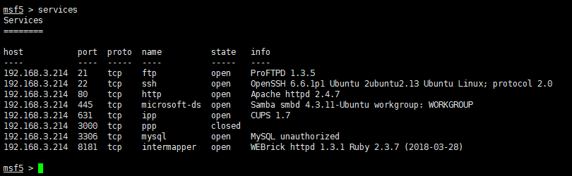
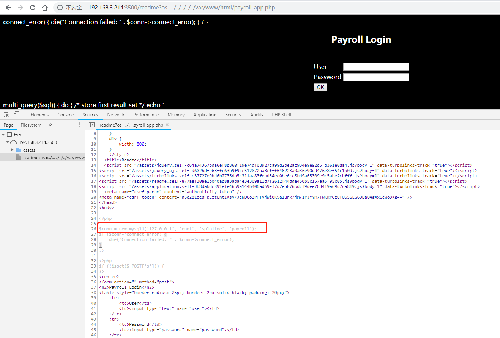
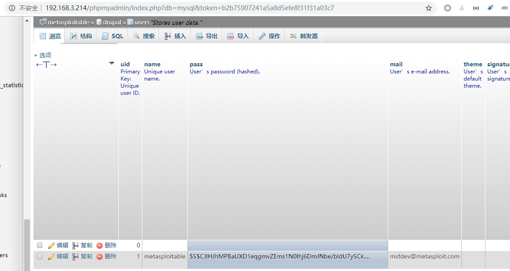
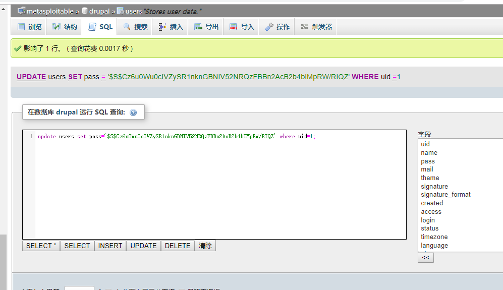

### metasploitable3 使用历程

- [metasploitable3-ctf 重要参考](https://github.com/16667/Metasploitable-3-CTF)
  - Web开启了目录树的文件遍历漏洞[CVE-2015-5531]()
  - [drupal密码复原重要漏洞](https://www.drupal.org/node/1023428)
  - [ubuntu普通用户提权重要漏洞](https://www.exploit-db.com/exploits/37292)

### 详细步骤教程
- 1, 通过 `nmap -sV -p- -v gaim_host` 可以得到对应的信息

- 2, 可以观察出来很多服务，下面就按照两个Web服务作为突破口
  - 显然这里3500的web漏洞有个文件路径遍历漏洞的BUG
  - 通过3500端口查看到 php 源代码文件
 

- 3, 进入phpmyadmin 获取drupal表和登录用户，进行漏洞利用 
 
  **重置密码**
  [drupal密码复原重要漏洞](https://www.drupal.org/node/1023428)

- 4, 文件执行漏洞进行

  - 修改 drupal 允许用户的编辑内容模板被渲染
  - 文件执行获取 apache 权限

- 5, [ubuntu普通用户提权重要漏洞](https://www.exploit-db.com/exploits/37292)提权到root

- 6, 开始夺旗